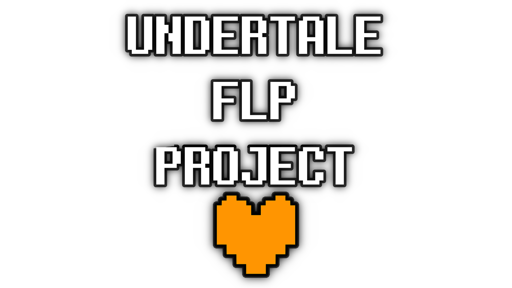

The UNDERTALE FLP Project is a project dedicated to remaking every UNDERTALE song with 90% accuracy in Toby's DAW of choice, FL Studio.
All songs in this archive are created / owned by Toby Fox. We do not own any of the songs in this archive.

## Dependencies

- A copy of FL Studio 20.8 or higher.

### VST:
- [magical8bitPlug](https://ymck.net/app/magical-8bit-plug-en)

- [NES VST](https://www.mattmontag.com/projects-page/nintendo-vst)

(or download straight from the [GitHub](https://github.com/cuzsie/UndertaleMusicFiles/tree/main/!!%20PLUGINS))

**VST PLUGINS ARE NATIVELY INSTALLED TO THE "C:\Program Files (x86)\VstPlugins" FOLDER!!**

### SOUNDFONTS:
(most soundfonts will be supplied in the FLP folder, but some are too big to push to the github.)

- [SGM Soundfont V2.01](https://archive.org/download/SGM-V2.01/SGM-V2.01.sf2)

- [Arachno SoundFont - Version 1.0](https://www.arachnosoft.com/main/download.php?id=soundfont-sf2)

## Discord

Join the UNDERTALE FLP Project Discord server for updates on the project, or for help with loading the project files.

- [Discord Server](https://discord.gg/eUEsHs8yTp)

## Soundtrack

Make sure to support the original developers of UNDERTALE and check out the OST on Spotify / Bandcamp

- [Spotify](https://open.spotify.com/album/2M2Ae2SvZe3fmzUtlVOV5Z)
- [Bandcamp](https://tobyfox.bandcamp.com/album/undertale-soundtrack)
